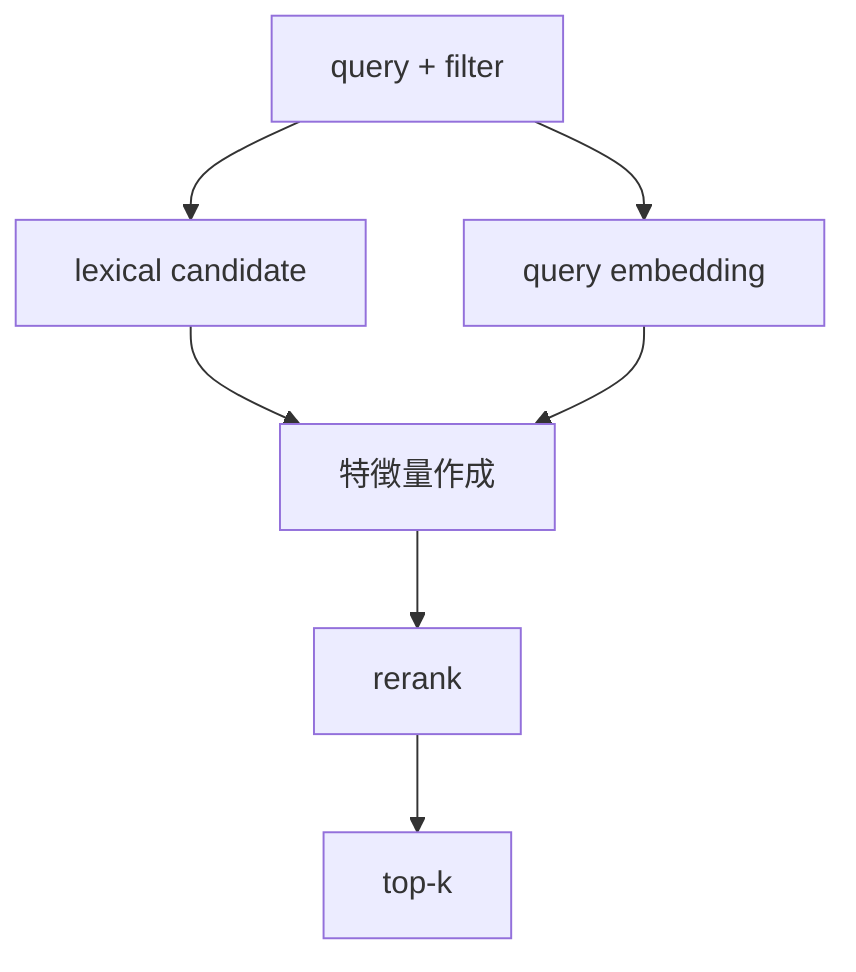
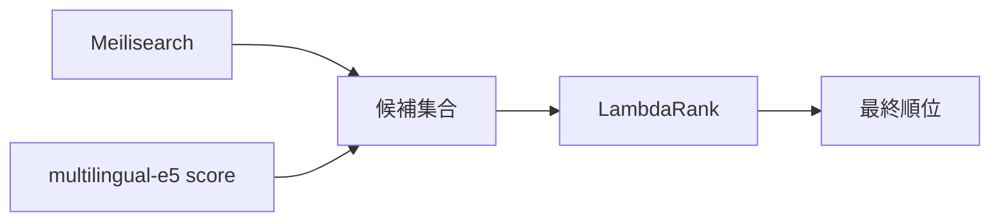
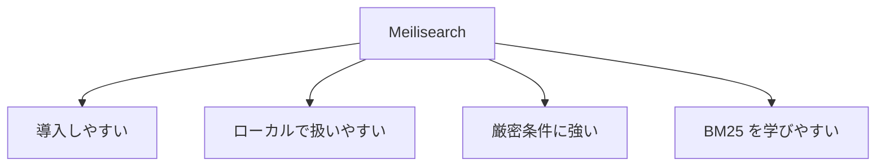
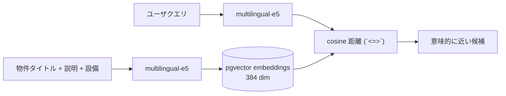
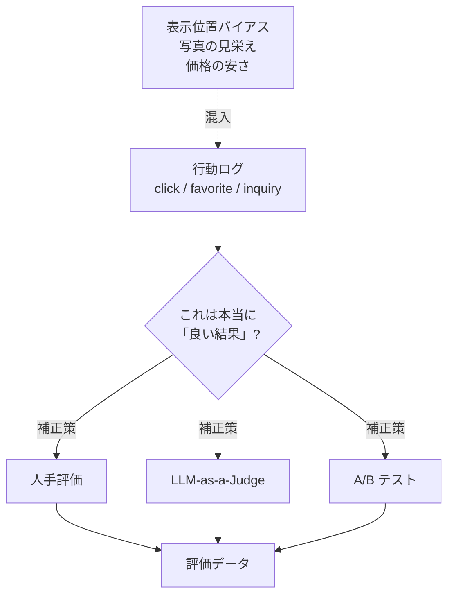

# 図解（Phase 3）

Phase 3 の教育資料で使う図解原稿。  
ハイブリッド検索の 3 段構成が伝わるものだけを残す。

---

## 図 1: 全体アーキテクチャ

```mermaid
flowchart LR
    U[ユーザー] --> API[/search]
    API --> Meili[Meilisearch]
    API --> E5[multilingual-e5]
    API --> Rank[LightGBM LambdaRank]
    API --> Cache[Redis]
    Rank --> Resp[検索結果]
```

---

## 図 2: 処理の流れ



---

## 図 3: 候補取得と再ランキングの分担



---

## 図 4: Meilisearch を使う理由



---

## 図 5: 回帰 vs ランキング (Phase 1 と Phase 3 の違い)

```mermaid
flowchart LR
    subgraph Phase1["Phase 1 — 住宅価格予測 (回帰)"]
      P1in[特徴量<br/>緯度・部屋数・築年] --> P1m[XGBoost / LightGBM]
      P1m --> P1out[価格 (数値)]
      P1out --> P1eval[RMSE / MAE]
    end
    subgraph Phase3["Phase 3 — 検索 (ランキング)"]
      P3in[クエリ + 候補集合] --> P3m[LightGBM LambdaRank]
      P3m --> P3out[順位付き Top-K]
      P3out --> P3eval[NDCG / MAP / Recall@K]
    end
```

> 同じ LightGBM でも、目的関数 (二乗誤差 vs LambdaRank) と評価指標が別物。

---

## 図 6: ベクトル検索のデータフロー



> 物件側ベクトルは `make seed` で事前投入、クエリ側は毎回オンデマンド。

---

## 図 7: 評価データの難しさ



> 行動ログだけでは「真の良さ」は測れない。複数チャネルで補正するのが実案件の作法。
